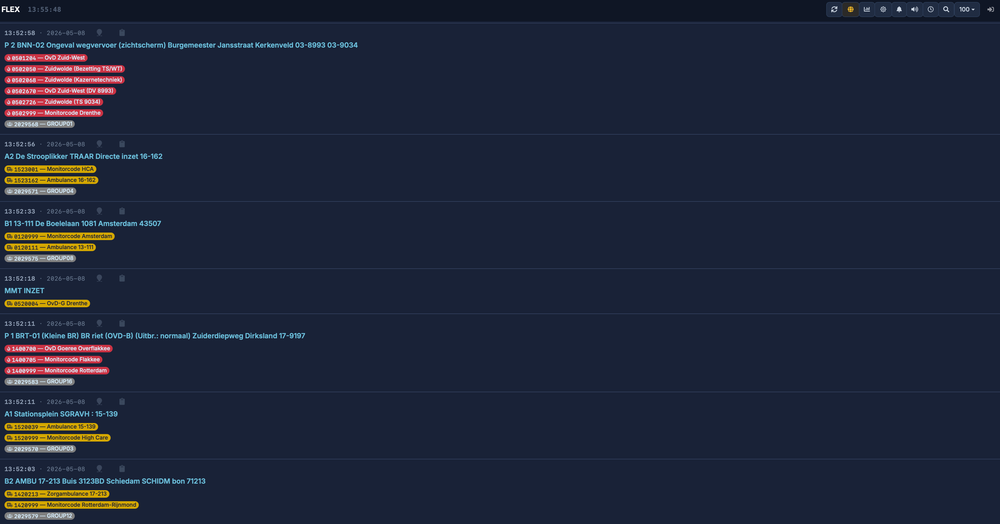
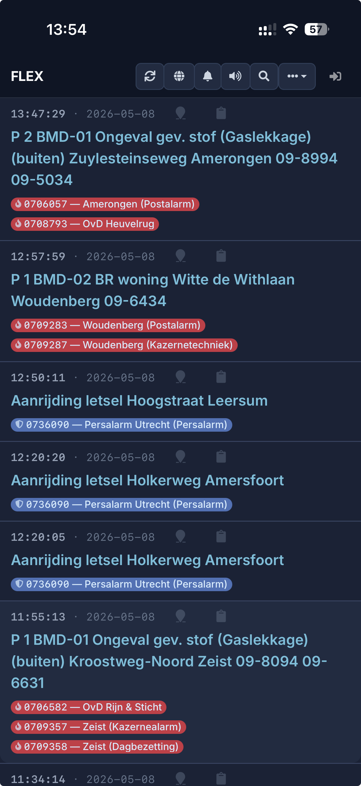

# PagerMon - Full Stack Paging Solution


*Desktop and Mobile view of the PagerMon interface*



This repository contains both the **PagerMon Server** and the **PagerMon Client**, providing a complete solution for receiving, processing, and displaying paging messages (POCSAG/FLEX).

## Project Structure

- `server/`: The Node.js based backend and web interface.
- `client/`: The client application (usually running on a Raspberry Pi or similar) that receives data from hardware and pushes it to the server.

---

## PagerMon Server

The server is responsible for storing messages in a database, providing a real-time web interface, and handling integrations via plugins (Webhooks, MQTT, Pushover, etc.).

### Prerequisites
- Node.js (v18+ recommended)
- SQLite (default) or MySQL/MariaDB

### Installation
1. Navigate to the server directory: `cd server`
2. Install dependencies: `npm install`
3. Use default config as base: `cp config/default.json config/config.json`
4. Start the server: `npm start` (or use PM2, see below)

### Features
- **Real-time Web UI:** View incoming messages as they arrive.
- **Advanced Filtering:** Hide or highlight messages based on regex or capcodes.
- **Webhook Integration:** Send messages to Home Assistant, Node-RED, or custom endpoints.
- **Plugin System:** Support for Discord, Telegram, Slack, Pushover, and more.

---

## PagerMon Client

The client captures raw paging data (e.g., from Multimon-NG or PDW) and sends it to the server's API.

### Prerequisites
- Node.js
- Hardware receiver (SDR Dongle or similar)

### Configuration
1. Navigate to the client directory: `cd client`
2. Install dependencies: `npm install`
3. Configure the client: `cp config/config.json.example config/config.json`
4. Edit `config/config.json`:
   - Set `hostname` to your server address (default is `http://localhost:3000` for local setups).
   - Set the `apikey` as defined in your Server settings.

### Usage
Run the reader script:
```bash
./reader.sh
```

---

## Deployment & Privacy

This repository is configured with `.gitignore` to prevent sensitive information from being committed.
- **Database:** Local SQLite files (`messages.db`) are excluded.
- **Configuration:** `config.json` files are excluded. Always use the provided `.example` or `default.json` files as a base for your local setup.
- **Sessions:** User sessions and PIDs are excluded.

---

## Running with PM2 (Recommended for Beginners)

PM2 is a process manager that ensures PagerMon starts automatically when your computer/Pi boots and restarts if it crashes.

### 1. Install PM2
```bash
sudo npm install -g pm2
```

### 2. Start the Server
Go to the server directory and start it:
```bash
cd server
pm2 start app.js --name "pagermon-server"
```

### 3. Start the Client
Go to the client directory and start the monitoring script:
```bash
cd client
pm2 start reader_monitoring.sh --name "pagermon-client"
```

### 4. Make it permanent
To make sure everything starts after a reboot:
```bash
pm2 save
pm2 startup
```
(Follow the instructions on your screen after running `pm2 startup`).

---

## Standard Webhook Format

PagerMon supports sending data via Webhooks. The standard output format is:

```json
{
  "address": "1234567",
  "message": "Alarm message text",
  "source": "SDR-01",
  "timestamp": 1715158800,
  "alias": "Fire Dept",
  "agency": "Fire"
}
```

---

## Troubleshooting & FAQ

### Does it create a database automatically?
Yes! On the first start, the server will create a `messages.db` SQLite file (if using SQLite) and run all necessary migrations to set up the tables. You don't need to provide a blank database.

### The client is not sending messages?
- Check your `apikey` in `client/config/config.json`. It must match one of the keys in the Server Admin -> Settings -> API Keys.
- Ensure the `hostname` in the client config points to your server (e.g., `http://localhost:3000`).
- Check the console output of the client for "401 Unauthorized" (wrong key) or "ECONNREFUSED" (server not reachable).

### Hardcoded Paths
Some scripts (like `reader_monitoring.sh` or `pagermon.config.js`) might contain specific paths for the original developer's environment (e.g., `/home/pi/`). Make sure to check these scripts and update the paths to match your installation directory.

### Privacy & Security
- **Never commit your `config.json`** to a public repository.
- The `.gitignore` file is pre-configured to exclude databases and sensitive configurations.
- Default admin password is set via `config/default.json`. Change it immediately after login.

---

## Credits & Acknowledgements

This project is a fork and consolidation of the original PagerMon project. We would like to extend a huge thank you to the **original PagerMon creators and contributors** (Dave McKenzie and many others) for their incredible work in building the foundation of this paging solution.

This version has been enhanced with:
- **Alpine.js** frontend modernization.
- **FLEX Group Calling** optimizations for the Dutch P2000 network.
- Consolidated **Client & Server** repository structure.

---
